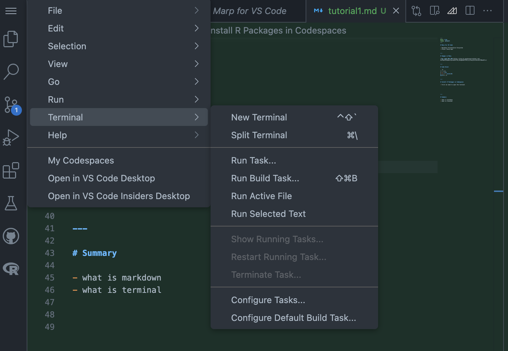

# Marp for VS Code

- Markdown Presentation Ecosystem
- https://marp.app/


---

# Images in Marp


--- 

# Code block

```R
# R code
x <- 1:10
y <- x + rnorm(10)
plot(x, y)
```

---

# Install R Packages in Codespaces

- First we need to open the terminal


---

# Summary

- what is markdown
- what is terminal 



- Once you open your terminal, you type:

```bash
R
```
- After this step, you can install packages as you normally do in RStudio

```R
install.packages("languageserver")
install.packages("tidyverse")
```


--- 

# Celebrate


Amazing! You have successfully installed R packages in Codespaces.